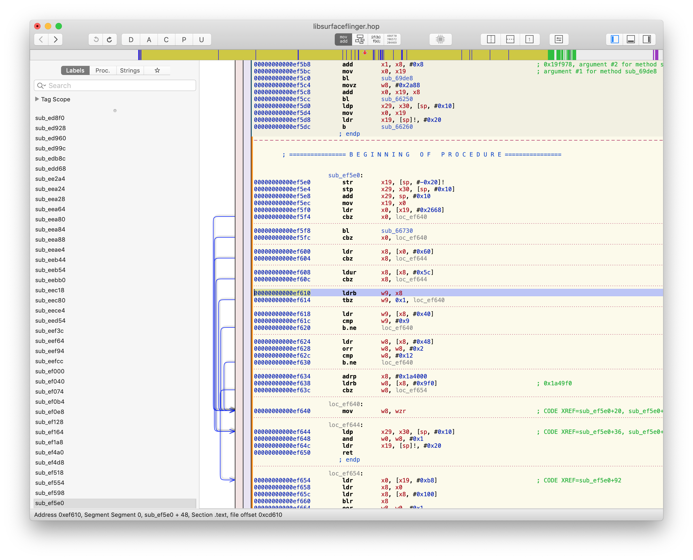
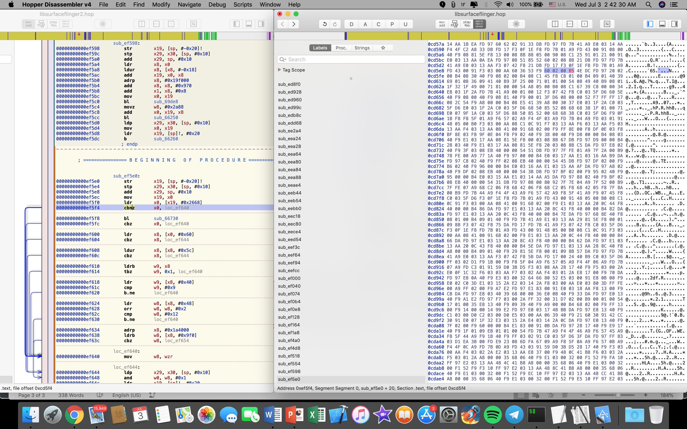

    F DEBUG  : *** *** *** *** *** *** *** *** *** *** *** *** *** *** *** ***
    F DEBUG  : Build fingerprint: 'Lenovo/jd2019/jd2019:9/PKQ1.180929.001/10.5.222_181213:user/release-keys'
    F DEBUG  : Revision: '0'
    F DEBUG  : ABI: 'arm64'
    F DEBUG  : pid: 741, tid: 741, name: surfaceflinger  >>> /system/bin/surfaceflinger <<<
    F DEBUG  : signal 11 (SIGSEGV), code 1 (SEGV_MAPERR), fault addr 0x896600000000
    F DEBUG  :  x0  000000762dfab510  x1  0000000000000000  x2  0000000000000000  x3  0000000000000001
    F DEBUG  :  x4  0000000c0a005181  x5  0000000c0a005181  x6  000000763142bae8  x7  0000000000000000
    F DEBUG  :  x8  0000896600000000  x9  0000000000000002  x10 0000000000000001  x11 0000000000000000
    F DEBUG  :  x12 0000000000000002  x13 0000000000000002  x14 0000000000000000  x15 0000000000000001
    F DEBUG  :  x16 00000076b1ea6c40  x17 00000076b20ccb74  x18 0000000000000000  x19 000000762dc74000
    F DEBUG  :  x20 0000007fc1e6b180  x21 0000007fc1e6b1b0  x22 0000000000000000  x23 0000000000000001
    F DEBUG  :  x24 0000000000000000  x25 0000007631491820  x26 00000076b4fa95e0  x27 00000076b1cf5120
    F DEBUG  :  x28 00000076b1cf5060  x29 0000007fc1e6af60
    F DEBUG  :  sp  0000007fc1e6af50  lr  00000076b1df45fc  pc  00000076b1df4610
    F DEBUG  :
    F DEBUG  : backtrace:
    F DEBUG  :  #00 pc 00000000000ef610  /system/lib64/libsurfaceflinger.so (android::ExBufferLayer::isHDRLayer() const+48)
    F DEBUG  :  #01 pc 000000000006a31c  /system/lib64/libsurfaceflinger.so (android::BufferLayer::onDraw(android::RenderArea const&, android::Region const&, bool) const+200)
    F DEBUG  :  #02 pc 00000000000bff1c  /system/lib64/libsurfaceflinger.so (android::SurfaceFlinger::doComposeSurfaces(android::sp<android::DisplayDevice const> const&)+1632)
    F DEBUG  :  #03 pc 00000000000bd0e0  /system/lib64/libsurfaceflinger.so (android::SurfaceFlinger::handleMessageRefresh()+2832)
    F DEBUG  :  #04 pc 00000000000ee9d0  /system/lib64/libsurfaceflinger.so (android::ExSurfaceFlinger::handleMessageRefresh()+16)
    F DEBUG  :  #05 pc 00000000000bc51c  /system/lib64/libsurfaceflinger.so (android::SurfaceFlinger::onMessageReceived(int)+3784)
    F DEBUG  :  #06 pc 0000000000014e04  /system/lib64/libutils.so (android::Looper::pollInner(int)+336)
    F DEBUG  :  #07 pc 0000000000014c18  /system/lib64/libutils.so (android::Looper::pollOnce(int, int*, int*, void**)+60)
    F DEBUG  :  #08 pc 00000000000ab710  /system/lib64/libsurfaceflinger.so (android::impl::MessageQueue::waitMessage()+84)
    F DEBUG  :  #09 pc 00000000000bacf4  /system/lib64/libsurfaceflinger.so (android::SurfaceFlinger::run()+20)
    F DEBUG  :  #10 pc 00000000000031f0  /system/bin/surfaceflinger (main+932)
    F DEBUG  :  #11 pc 00000000000ca784  /system/lib64/libc.so (__libc_init+88)

**How to fix  `isHDRLayer` crashing error**

Requirements:
 - Hopper disassembler

1. Open libsurfaceflinger.so with Hopper

2. Read offset of isHDRLayer from error line of logcat and find it in hopper
`F DEBUG  :  #00 pc 00000000000ef610  /system/lib64/libsurfaceflinger.so (android::ExBufferLayer::isHDRLayer() const+48)`
(here offset is 00000000000ef610)

3. In this function find first “cbz” (for example here it is on 0xef5f4) and select it

4. Change to hex editor view (⇧⌘H), double click and edit B4 to B5 which makes “cbz” to “cbnz”  

5. Save file using “file->produce new executable” (⇧⌘E)

6. Done
